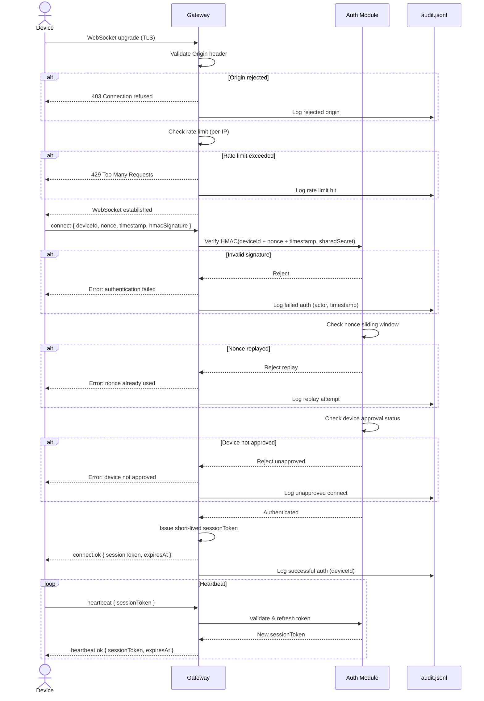
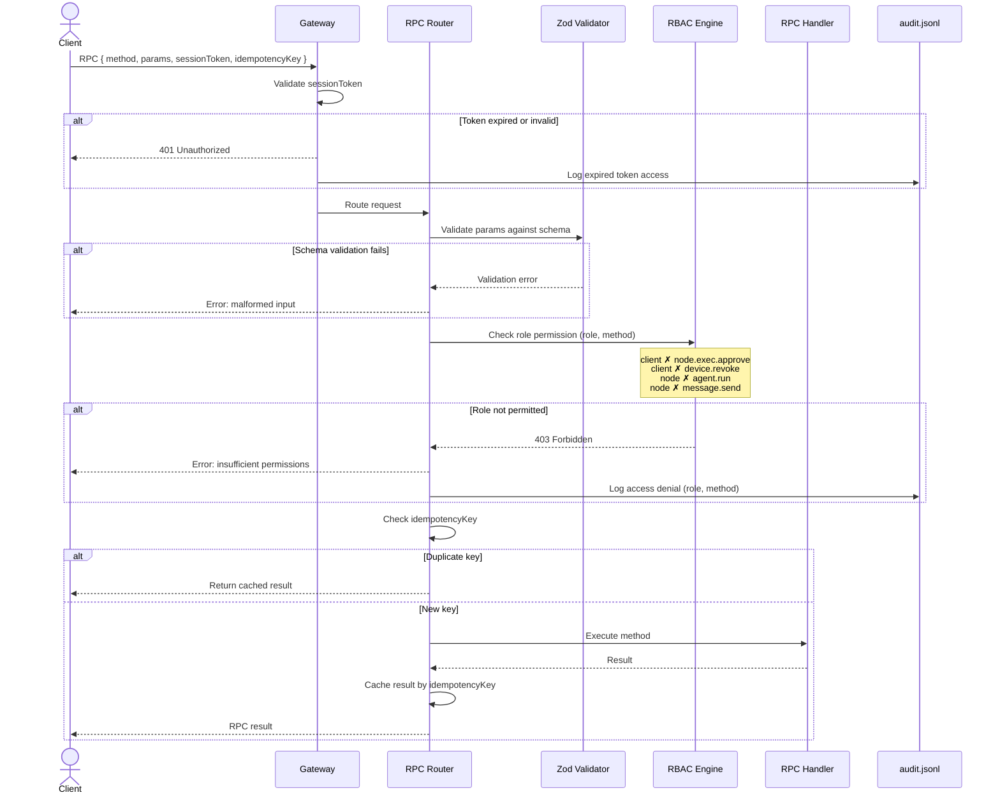
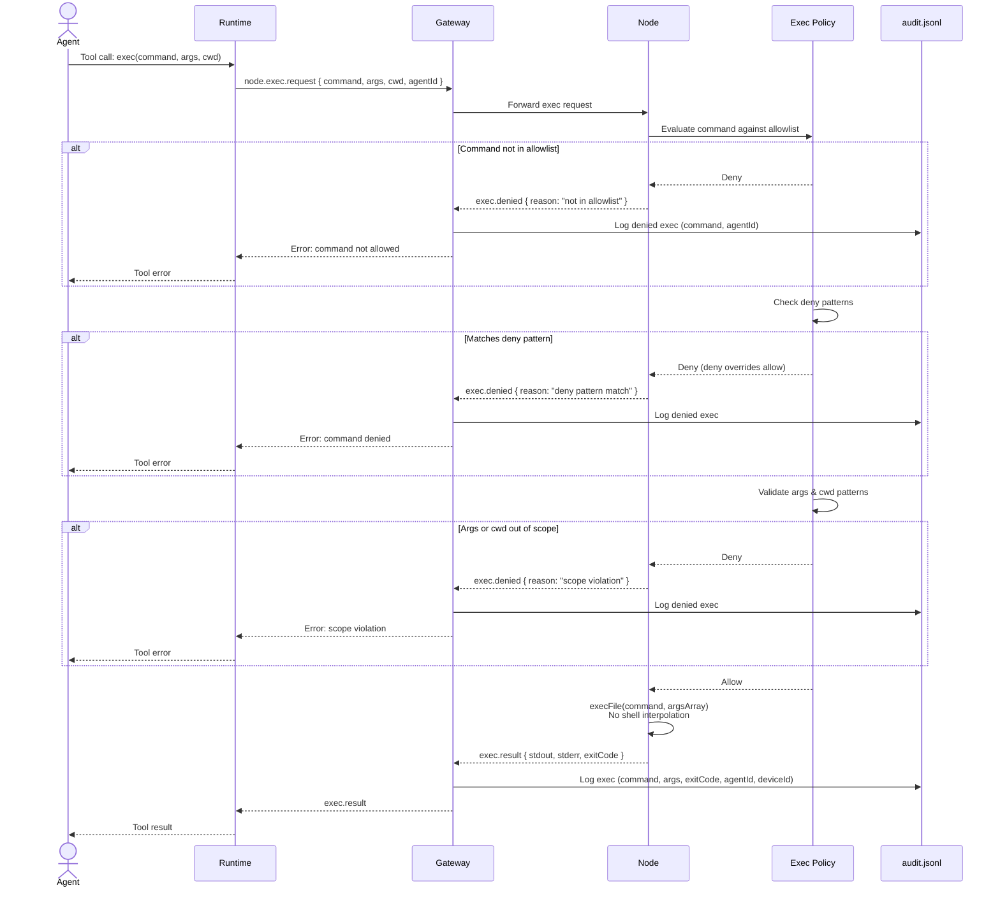
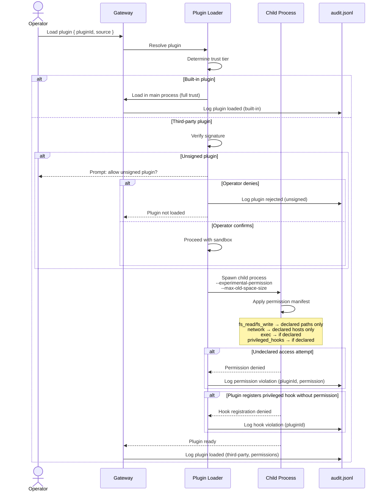
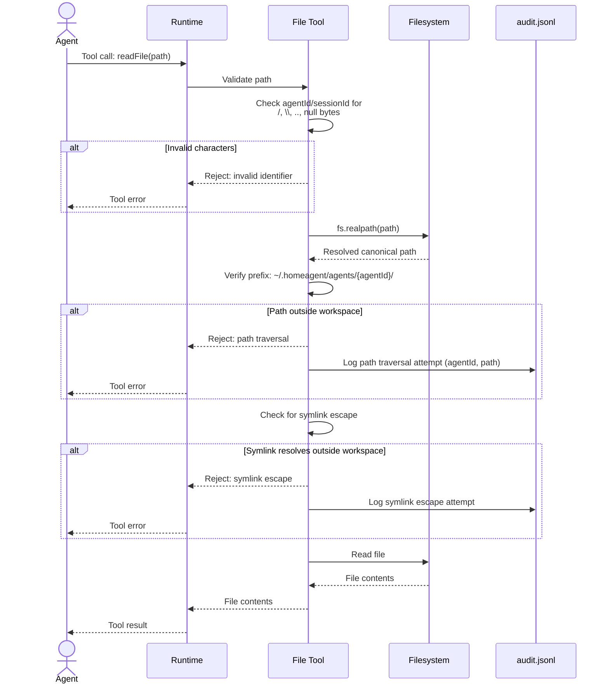
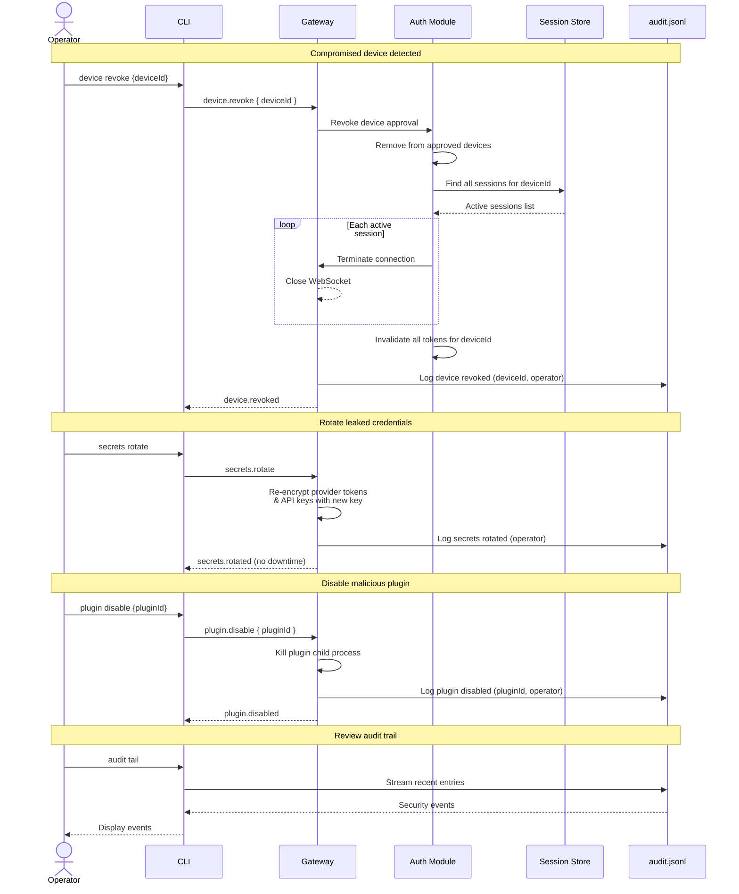
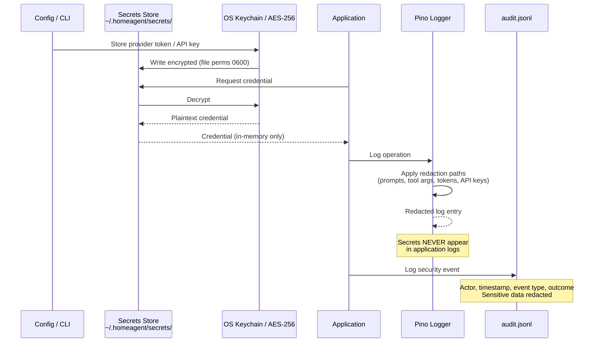

# Security Sequence Diagrams

UML sequence diagrams for HomeAgent security interactions. For flowcharts see [security.md](./security.md). For full details see [plan.combined.md](./plan.combined.md) § Security Considerations.

---

## Device Pairing & Authentication

Every device must complete a multi-step handshake before gaining any access to the system. The gateway first enforces network-level protections (TLS, origin validation, rate limiting), then requires the device to prove its identity via an HMAC-signed challenge using a shared secret established during pairing. Nonce replay protection and device approval status are verified before a short-lived session token is issued. Tokens are automatically refreshed via heartbeat to limit the exposure window if a token is compromised. Every rejection is recorded in the immutable audit log.

## RPC Request Authorization

Once authenticated, every RPC request passes through three validation layers before execution. The session token is verified for expiry, the request payload is validated against a strict Zod schema to reject malformed input, and the RBAC engine checks whether the caller's role is permitted to invoke the requested method. For example, a `client` role cannot call `node.exec.approve` and a `node` role cannot call `agent.run`. Idempotency keys ensure that duplicate requests return cached results rather than re-executing side effects.

## Remote Exec Approval

Remote command execution is the highest-risk operation in the system and is gated by a scoped policy engine on each node. When an agent requests execution, the node evaluates the command against a JSON allowlist of permitted commands, argument patterns, and working directories. Deny patterns take precedence over allow patterns to ensure dangerous commands cannot slip through. All execution attempts — approved or denied — are fully logged with command, arguments, exit code, and the requesting agent and device identifiers.

## Plugin Loading & Sandboxing

Plugins follow a two-tier trust model. Built-in plugins run in the main process with full access, while third-party plugins are isolated in sandboxed child processes with restricted permissions. Unsigned third-party plugins require explicit operator confirmation before loading. Each plugin declares a permission manifest specifying which capabilities it needs (`fs_read`, `fs_write`, `network`, `exec`, `privileged_hooks`), and any undeclared access is blocked at the runtime level. Resource limits (timeouts and memory caps) prevent runaway plugins from affecting system stability.

## File Access & Path Traversal Prevention

File operations are constrained to each agent's designated workspace directory (`~/.homeagent/agents/{agentId}/`). Every file path is first checked for dangerous characters (`/`, `\`, `..`, null bytes) in identifiers, then resolved to its canonical form via `fs.realpath()` and verified against the allowed workspace prefix. Symlink escape attempts — where a symlink inside the workspace points to a location outside it — are detected and rejected. All traversal and escape violations are logged to the audit trail for forensic review.

## Device Revocation & Incident Response

When a security incident is detected, operators can respond immediately through the CLI without system downtime. Revoking a compromised device terminates all of its active connections and invalidates every associated token in a single atomic operation. Leaked credentials can be rotated and re-encrypted seamlessly. Malicious plugins can be killed instantly. The audit trail provides a real-time stream of security events to support investigation and post-incident analysis.

## Secret Storage & Redaction

Sensitive credentials (provider tokens, LLM API keys, device shared secrets) are encrypted at rest using the OS keychain or AES-256 with a master passphrase, and stored with restrictive file permissions (`0600`). Credentials are decrypted only in-memory when needed and are never written to application logs. Pino's redaction paths automatically strip prompts, tool arguments, tokens, and API keys from all log output. The audit log similarly records only event metadata (actor, timestamp, event type, outcome) with sensitive data redacted by default.

