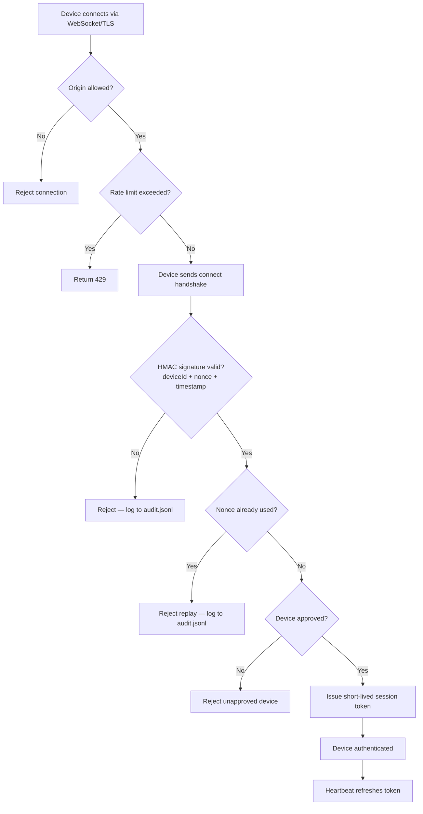
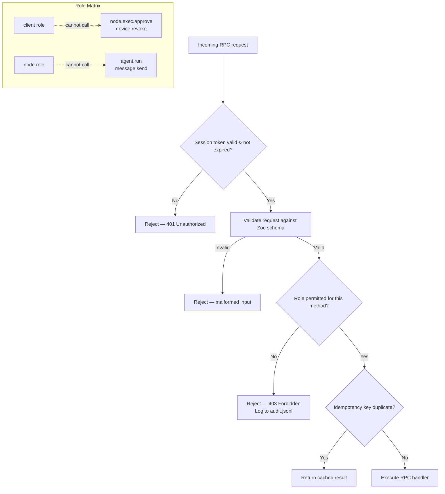
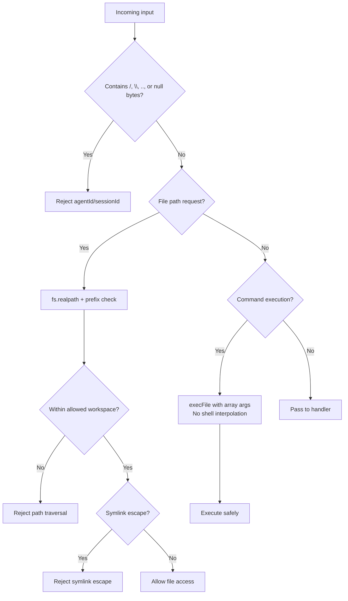
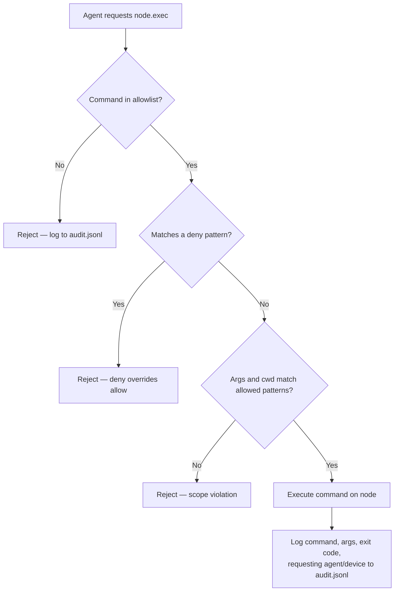
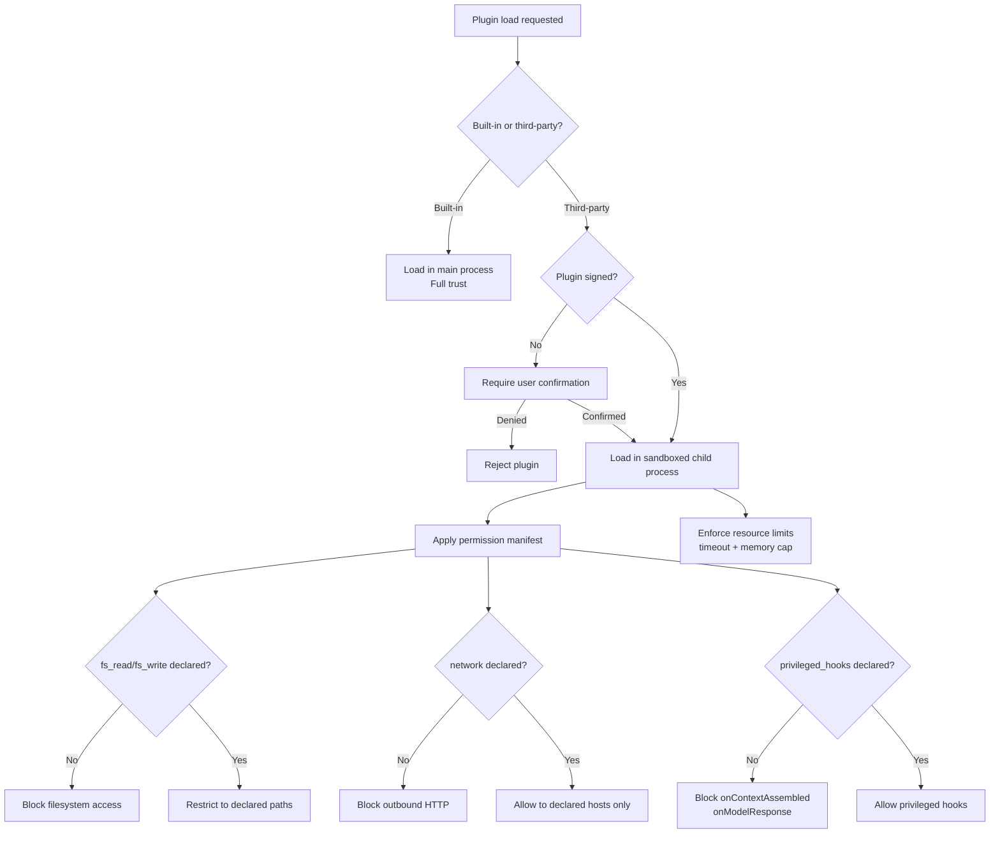
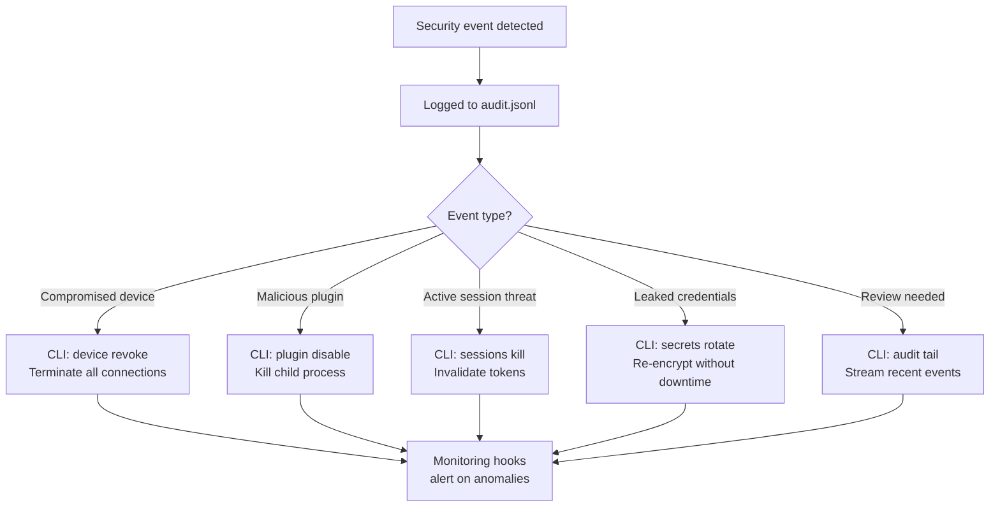

# Security Architecture

This document provides visual workflows for the HomeAgent security model. For full details, see [plan.combined.md](./plan.combined.md) § Security Considerations.

---

## Device Authentication & Session Flow



## RPC Authorization (RBAC)



## Input Validation & Injection Prevention



## Exec Approval Flow



## Plugin Security & Sandboxing



## End-to-End Security Layering

```mermaid
flowchart LR
    subgraph Network
        TLS[TLS encryption]
        ORIGIN[Origin validation]
        RATE[Rate limiting]
        SIZE[Frame size limits]
    end

    subgraph Authentication
        HMAC[HMAC challenge]
        NONCE[Nonce replay protection]
        TOKEN[Session tokens]
    end

    subgraph Authorization
        RBAC[Role-based access]
        ZOD[Zod schema validation]
        IDEMP[Idempotency keys]
    end

    subgraph Data Protection
        SECRETS[Encrypted secrets\nOS keychain / AES-256]
        REDACT[Log redaction\npino redaction paths]
        ISOLATION[Session isolation\nper-sender DM]
    end

    subgraph Sandboxing
        WORKSPACE[Agent workspace isolation]
        PLUGIN_SANDBOX[Plugin child process\nsandbox]
        EXEC_ALLOW[Exec allowlists\ndeny precedence]
        RESOURCE[Resource limits\ntimeouts + memory]
    end

    subgraph Audit
        LOG[Immutable audit.jsonl]
        CLI_IR[Incident response CLI\nrevoke / disable / rotate]
        HOOKS[Monitoring hooks\nanomaly alerting]
    end

    Network --> Authentication --> Authorization --> Data Protection --> Sandboxing --> Audit
```

## Incident Response


